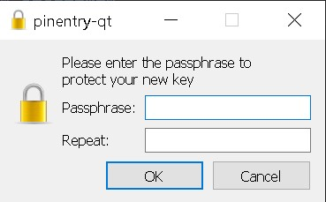
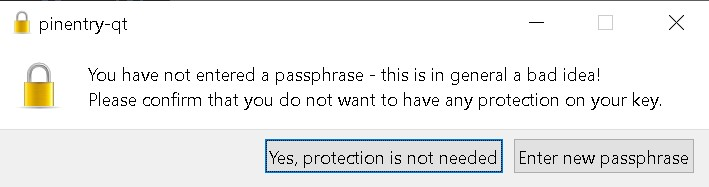
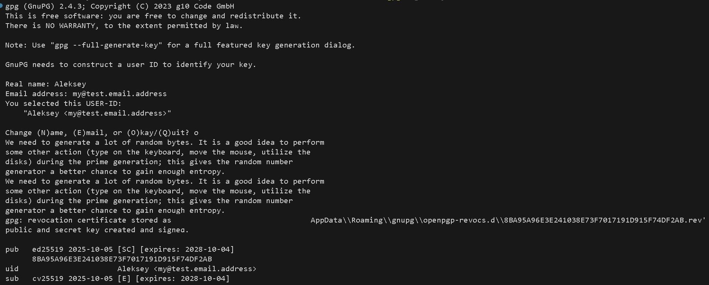

# Практическое задание
Коллеги просят вас доработать helm-чарт (или переписать заново, на ваше усмотрение) и добавить к нему поддержку секретов.

В данном задании доводить приложение до полноценного запуска не требуется (это мы попросим в следующем задании), задача просто создать нужные ресурсы и проверить, что helm верно генерирует шаблон

# Склонируйте репозиторий https://gitlab.rebrainme.com/kubernetes-local-for-tasks/helm-secrets.
## Решение
```bash
git clone https://gitlab.rebrainme.com/kubernetes-local-for-tasks/helm-secrets
git remote remove origin
git remote add origin https://github.com/<указываем Ваш репозиторий>.git
git branch -M main
git push -u origin main
```
# Сгенерируйте собственный gpg-ключ.
## Решение
```bash
gpg --gen-key
```
Вводим своё имя и почтовый адрес. Они нужны, чтобы различать ключи между собой.  
Далее отказываемся от установки пароля. Обратите внимание, ключ должен быть строго без пароля, иначе работать не будет!  
Нажимаем **cancel**  
  
далее **Yes, protection is not need**  
  
В результате у нас получается следующий вывод  
  
# Убрать секреты в отдельный файл и зашифровать
Внутри папки .infra, создайте файл secrets.prod.yaml, который будет содержать список private_env_variables, внутри которого будут указаны переменные (переменные надо взять из values.prod.yaml):  
* API_KEY
* PGSQL_URI
Удалите переменные API_KEY / PGSQL_URI из values.prod.yaml.  
В итоге у вас должно получиться два файла:  
* values.prod.yaml, который содержит public_env_variables (LISTEN),  
```yaml
public_env_variables:
  LISTEN: ":8080"
```
* secrets.prod.yaml, который содержит private_env_variables (API_KEY / PGSQL_URI).  
```yaml
private_env_variables:
  API_KEY: "dgs...WZ2"
  PGSQL_URI: "postgresql://u...mb4@db-sta...2/stage?sslmode=disable"
```
Зашифруйте secrets.prod.yaml с помощью sops и ключа.
Внимание, если мы попытаемся зашифровать секреты командой 
```bash
sops --encrypt --pgp 8BA95A96E3E241038E73F7017191D915F74DF2AB secrets.prod.yaml > secrets.prod.yaml
```
то получим ошибку
```bash
panic: runtime error: index out of range [0] with length 0

goroutine 1 [running]:
main.encrypt(0x1f8b020, 0xc00045f830, 0x22ad6abae58, 0x2629f88, 0x22ad6abae58, 0x2629f88, 0xc000086380, 0x69, 0xc0003acfa0, 0x1, ...)
        /home/runner/work/sops/sops/cmd/sops/encrypt.go:68 +0x9b8
main.main.func8(0xc000124f20, 0x0, 0x0)
        /home/runner/work/sops/sops/cmd/sops/main.go:788 +0x30ff
gopkg.in/urfave/cli%2ev1.HandleAction(0x1be7e80, 0x1e05b30, 0xc000124f20, 0x0, 0x0)
        /home/runner/work/sops/sops/vendor/gopkg.in/urfave/cli.v1/app.go:490 +0x89
gopkg.in/urfave/cli%2ev1.(*App).Run(0xc000398820, 0xc0000e4000, 0x5, 0x8, 0x0, 0x0)
        /home/runner/work/sops/sops/vendor/gopkg.in/urfave/cli.v1/app.go:264 +0x5f5
main.main()
        /home/runner/work/sops/sops/cmd/sops/main.go:987 +0x3885
```
Из-за того, что мы пытаемся записать зашифрованный вывод в тот же файл, который читаете.  
Поэтому делаем так
```bash
cd .infra
sops --encrypt --pgp 8BA95A96E3E241038E73F7017191D915F74DF2AB secrets.prod.yaml > secrets.prod.yaml.enc
mv secrets.prod.yaml.enc secrets.prod.yaml
```
Проверяем, что механизм работает.
```bash
sops --decrypt --pgp 8BA95A96E3E241038E73F7017191D915F74DF2AB secrets.prod.yaml > secrets.prod.yaml.dec
```
Выгружаем приватный ключ и передаём коллеге, чтобы он его у себя импортировал и смог расшифровать данные, или для использования его в ci/cd
```bash
# Выгружаем ключ
gpg --armor --export-secret-key 8BA95A96E3E241038E73F7017191D915F74DF2AB > private.asc
# Импортируем ключ
gpg --armor --import private.asc
```
Если работаете из под Windows файл необходимо конвертировать в ASCII
```powershell
Get-Content private.asc | Out-File -Encoding ASCII private.asc.ascii
mv -Force private.asc.ascii private.asc
```
Протестируем установку нашего манифеста с помощью secret плагина для helm. Устанавливаем плагин
```bash
helm plugin install https://github.com/jkroepke/helm-secrets
```
Устанавливаем наше приложение в кластер
```bash
cd .infra
helm secrets upgrade --install --create-namespace -n helm-secret helm-secret ./chart -f secrets.prod.yaml -f values.prod.yaml
```
Внимание! Если установка производится из под Windows и после ввода команды нет ифнормации от плагина secrets
```bash
Release "helm-secret" does not exist. Installing it now.
NAME: helm-secret
LAST DEPLOYED: Sun Oct  5 12:43:09 2025
NAMESPACE: helm-secret
STATUS: deployed
REVISION: 1
TEST SUITE: None
```
Значит необходимо конвертировать файл в кодировку 
```powershell
Get-Content secrets.prod.yaml | Out-File -Encoding ASCII secrets.prod.yaml.ascii
mv -Force secrets.prod.yaml.ascii secrets.prod.yaml
```
После этого вывод команды установки будет правильный
```bash
[helm-secrets] Decrypt: secrets.prod.yaml
Release "helm-secret" has been upgraded. Happy Helming!
NAME: helm-secret
LAST DEPLOYED: Sun Oct  5 12:48:31 2025
NAMESPACE: helm-secret
STATUS: deployed
REVISION: 2
TEST SUITE: None
[helm-secrets] Removed: secrets.prod.yaml.dec
```